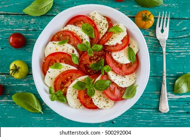

# Mamiton

<!DOCTYPE html>
<html>
<head>
  Recettes de cuisine de Mamie
</head>
<body>
  <header>
    
    <h1>Recettes de cuisine de Mamie</h1>
  </header>
  <main>
    <h2>Bienvenue sur le site des recettes de cuisine de Mamie !</h2>
    
Retrouvez ici toutes les recettes de cuisine de Mamie, transmises de génération en génération. Nous avons sélectionné pour vous nos meilleures recettes d'entrées et de plats.

    
 </header>
  <h1>Entrées</h1>
  
Salade de tomates

  
  
Ingrédients : tomates, oignons, basilic, huile d'olive, vinaigre balsamique, sel, poivre.
    
  Préparation : Coupez les tomates en tranches, émincez les oignons, mélangez avec le basilic haché. Assaisonnez avec l'huile d'olive, 
    le vinaigre balsamique, le sel et le poivre. Servez frais.
  
  
  
  Tarte aux poireaux

Ingrédients : pâte brisée, poireaux, crème fraîche, œufs, gruyère râpé, sel, poivre.
Préparation : Préchauffez le four à 180°C. Faites revenir les poireaux émincés dans une poêle avec un peu d'huile d'olive jusqu'à ce qu'ils soient tendres. Étalez la pâte brisée dans un moule à tarte, ajoutez les poireaux cuits. Dans un bol, mélangez la crème fraîche, les œufs battus, le gruyère râpé, le sel et le poivre. Versez ce mélange sur les poireaux. Enfournez pendant environ 30 minutes, jusqu'à ce que la tarte soit dorée.

    
