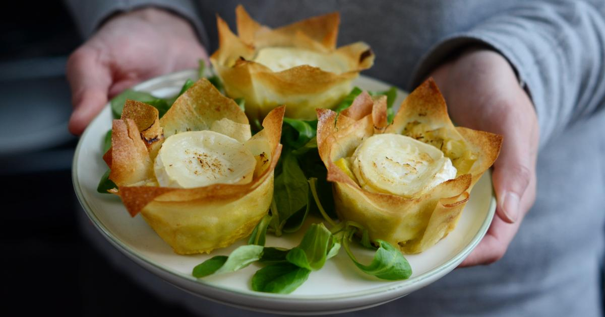
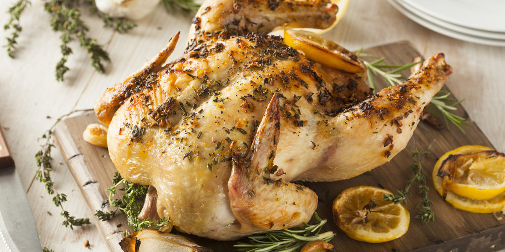
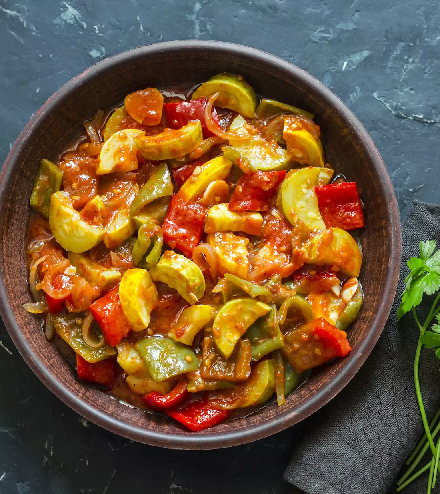

# mamiton
les recettes de mamie          
        
<head>
</head>
<body>
  <header>
    
    <h1>Recettes de cuisine</h1>
  </header>

  <main>
      <h2>Entrées</h2>
      <ul>
        <li>
          <h3>Salade de tomates et mozzarella</h3>
          
          
Voici la recette de la délicieuse salade de tomates et mozzarella.

          <ul>
            <li>6 tomates</li>
            <li>1 boule de mozzarella</li>
            <li>1/4 tasse de basilic frais</li>
            <li>2 cuillères à soupe d'huile d'olive</li>
            <li>Sel et poivre</li>
          </ul>
        </li>
        <li>
          <h3>Tartelette aux poireaux et au chèvre</h3>
           
          
Voici la recette de la tartelette aux poireaux et au chèvre.

          <ul>
            <li>1 pâte feuilletée</li>
            <li>2 poireaux</li>
            <li>1 bûche de chèvre</li>
            <li>3 œufs</li>
            <li>1/2 tasse de crème fraîche</li>
          </ul>
    <main>
        <h2>Plats</h2>
        <li> 
          <h3>Poulet rôti aux herbes</h3>
          
          
Voici la recette du poulet rôti aux herbes.

          <ul>
            <li>1 poulet entier</li>
            <li>3 gousses d'ail</li>
            <li>1/4 tasse de thym frais</li>
            <li>1/4 tasse de romarin frais</li>
            <li>2 cuillères à soupe d'huile d'olive</li>
            <li>Sel et poivre</li>
          </ul>
        </li>
        <li>
          <h3>Ratatouille</h3>
                
          
Voici la recette de la ratatouille.

          <ul>
            <li>1 aubergine</li>
            <li>1 courgette</li>
            <li>1 poivron rouge</li>
          </ul>
        </li>
  
    
    

